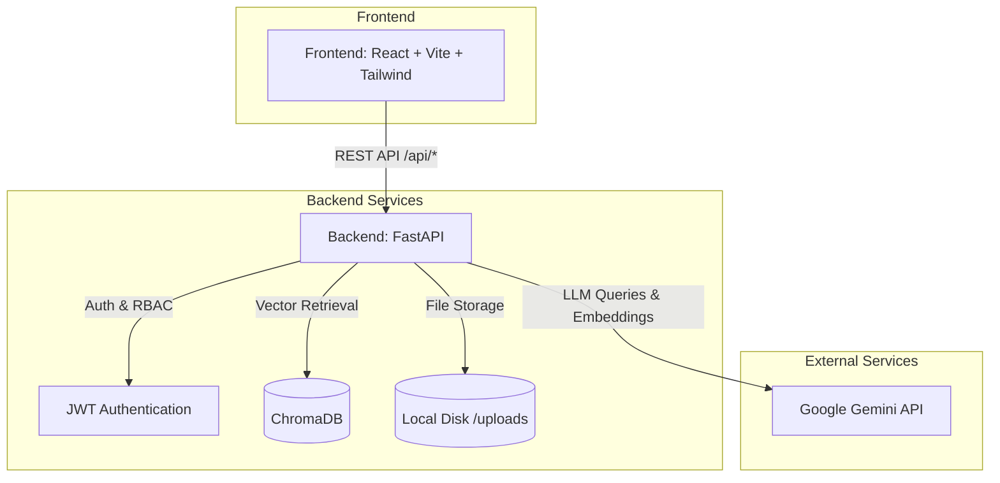
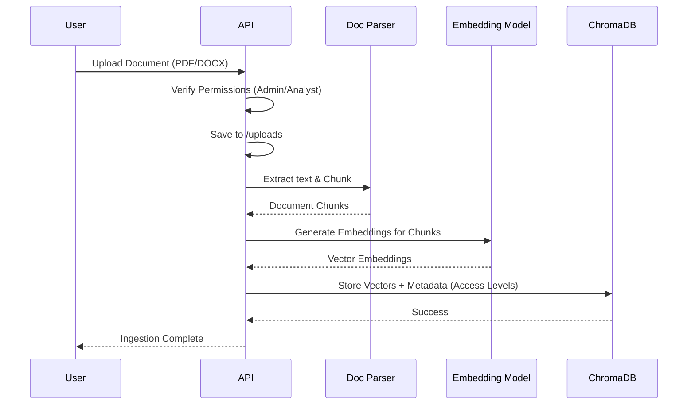
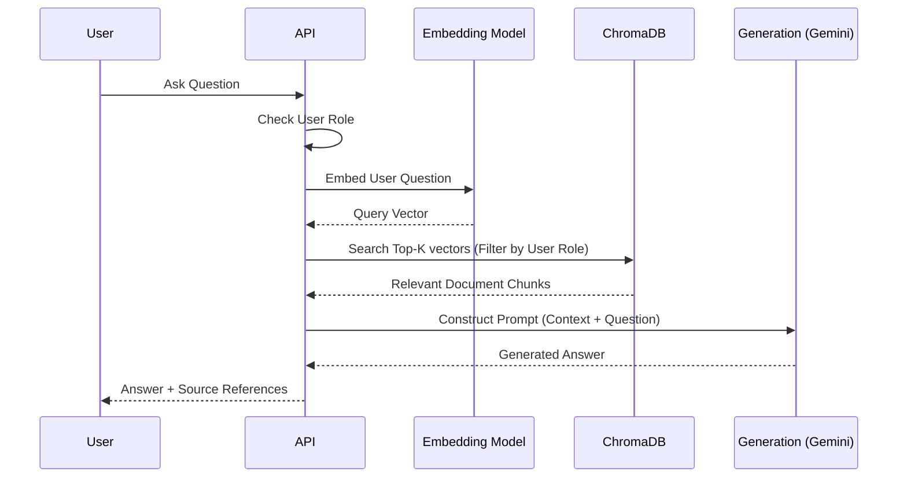

# Architecture

## Overview
The RAG (Retrieval-Augmented Generation) Knowledge Assistant is a multi-tier application designed to ingest organizational documents, encode them into a vector database, and provide an intelligent QA interface based on role-based access control (RBAC).

## Technology Stack

| Component | Technology | Purpose |
| --- | --- | --- |
| **Frontend** | React, Vite, TailwindCSS, Lucide React | User interface, chat experience, document management |
| **Backend API** | FastAPI (Python) | High-performance async API, routing, validation |
| **Vector DB** | ChromaDB | Local vector store for document embeddings |
| **LLM & Embeddings** | Google Gemini API (gemini-2.0-flash, text-embedding-004) | Answer generation and text vectorization |
| **Document Processing** | PyPDF2, python-docx, LangChain Text Splitters | Parsing and chunking uploaded documents |
| **Authentication** | JWT (PyJWT) | Role-based token authentication |

## Document Ingestion Flow

## Query & Generation Flow (RAG)

## Component Details

### User Roles & Permissions
The system uses a hardcoded demo user structure (Viewer, Analyst, Admin) embedded in tokens.
- **Viewer**: Read-only access to 'all' level documents.
- **Analyst**: Read/upload access to 'analyst' and 'all' documents.
- **Admin**: Full access to all document tiers.

### Data Storage
- **ChromaDB**: Persisted to `./chroma_data`. Contains collections for document chunks. Metadata includes document name and access level to enable pre-filtering during queries.
- **Filesystem**: Raw documents are stored in `./uploads`.

## Scalability & Security Considerations

**Security:**
- Role-based metadata filtering at the vector DB level ensures users cannot retrieve chunks from documents above their clearance.
- Authentication relies on stateless JWTs.

**Scalability (Current Architecture):**
- ChromaDB is running in-memory/local-persist mode within the FastAPI container. This limits horizontal scaling of the backend.
- File uploads are stored locally.

**Path to Production:**
- Replace local ChromaDB with a standalone Chroma service or managed vector database (e.g., Pinecone, Weaviate).
- Move uploaded files to object storage (S3/GCS).
- Replace hardcoded users with a proper identity provider (OAuth/OIDC) and relational database (PostgreSQL) for user data.
